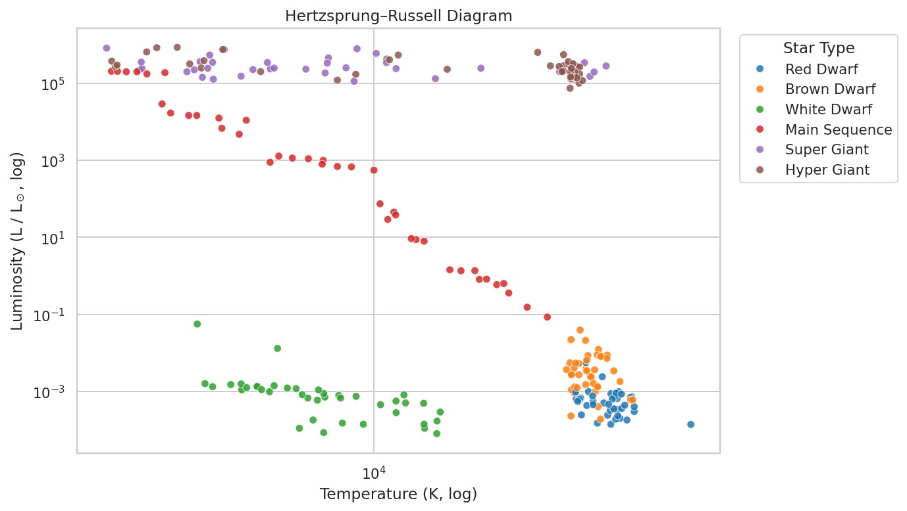
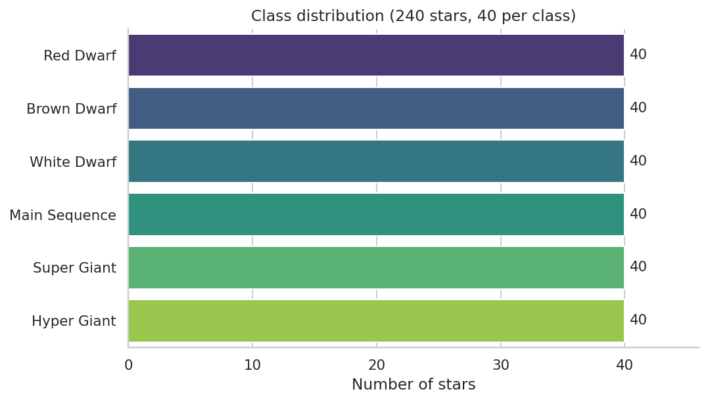
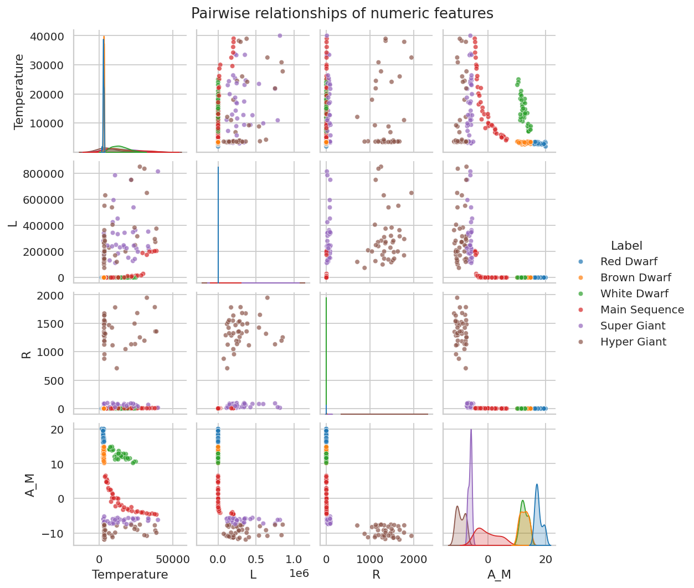
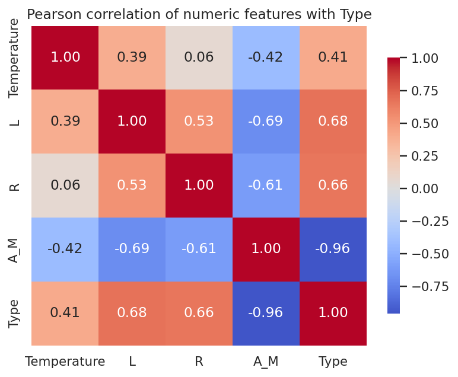
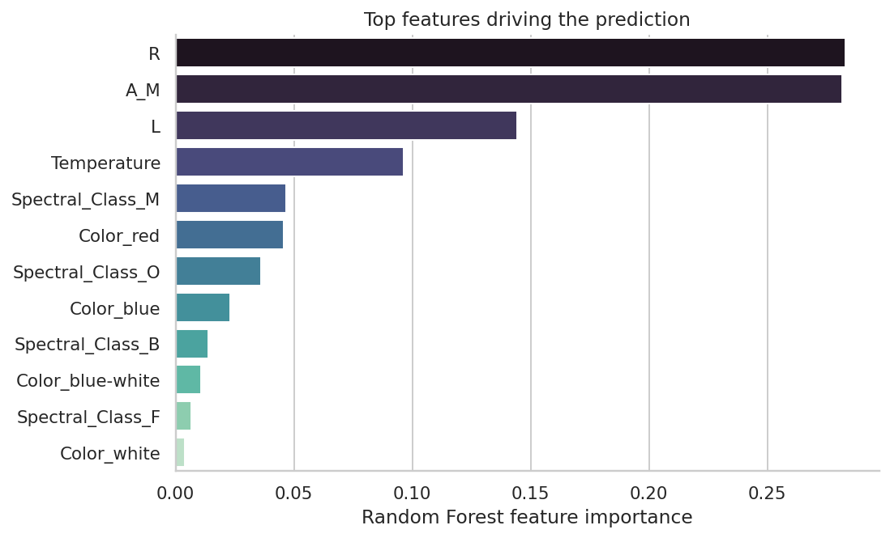
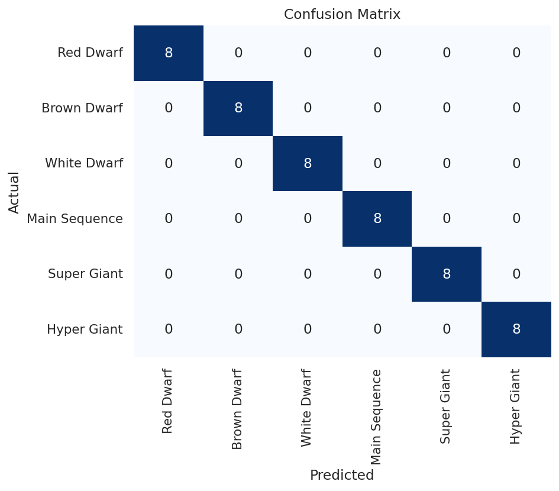

# Star Type Classification

Predict the **stellar type** of a star (Red Dwarf → Hyper Giant) from a small
set of physical measurements, using a reproducible scikit-learn pipeline.

The model achieves **100% accuracy on the held-out test set** and
**100% mean 5-fold cross-validation accuracy** on the full dataset — see
[Verified results](#verified-results) for the full report and confusion matrix.

<p align="center">
  
</p>

---

## Table of contents

- [Why this project](#why-this-project)
- [The dataset](#the-dataset)
- [Exploratory analysis](#exploratory-analysis)
- [Modelling approach](#modelling-approach)
- [Verified results](#verified-results)
- [Repository layout](#repository-layout)
- [Quick start](#quick-start)
- [Reproducing the figures](#reproducing-the-figures)
- [Predicting on new stars](#predicting-on-new-stars)
- [Testing](#testing)
- [License](#license)

---

## Why this project

The six broad star types in `Stars.csv` (Red Dwarf, Brown Dwarf, White Dwarf,
Main Sequence, Super Giant, Hyper Giant) form **visually well-separated
clusters in the Hertzsprung–Russell diagram**. That makes the dataset a clean
end-to-end example for:

- preprocessing mixed numeric / categorical features with `ColumnTransformer`,
- training and persisting an `sklearn` pipeline,
- reporting honest evaluation metrics (held-out test split **and** 5-fold CV),
- shipping a small CLI for training and inference.

If you want a notebook walk-through, the original analysis lives in
`StartypeclassificationprojectTirtheshjani.ipynb`.

---

## The dataset

`Stars.csv` holds **240 stars**, perfectly balanced at 40 stars per class.

| Column           | Description                                         |
|------------------|-----------------------------------------------------|
| `Temperature`    | Surface temperature in Kelvin                       |
| `L`              | Luminosity relative to the Sun (L / L<sub>☉</sub>)  |
| `R`              | Radius relative to the Sun (R / R<sub>☉</sub>)      |
| `A_M`            | Absolute magnitude (M<sub>v</sub>)                  |
| `Color`          | General color of the spectrum                       |
| `Spectral_Class` | Spectral class (O, B, A, F, G, K, M)                |
| `Type`           | Target label, 0–5 (see below)                       |

**Target labels**

| Code | Star type     |
|------|---------------|
| 0    | Red Dwarf     |
| 1    | Brown Dwarf   |
| 2    | White Dwarf   |
| 3    | Main Sequence |
| 4    | Super Giant   |
| 5    | Hyper Giant   |

<p align="center">
  
</p>

The raw `Color` column is messy — it mixes spellings such as `Blue White`,
`Blue-white`, `Bluewhite`, and `Whitish`. `src.data_utils.normalize_color`
collapses these variants into a small canonical vocabulary
(`blue`, `blue-white`, `white`, `yellow-white`, `yellow`, `yellow-orange`,
`orange`, `orange-red`, `red`), which keeps the one-hot feature space tight
and stable.

---

## Exploratory analysis

### Hertzsprung–Russell diagram

Plotting luminosity against temperature on log axes recovers the classic
HR-diagram structure: dwarfs along the bottom, the main sequence sweeping
diagonally, and giants / hyper giants forming the bright band on top.

<p align="center">
  
</p>

### Pairwise feature relationships

Numeric features are not independent — `R`, `L`, and `A_M` co-vary strongly
with stellar type, while `Temperature` separates the cool dwarf cluster from
the rest.

<p align="center">
  
</p>

### Correlation with the target

Absolute magnitude `A_M` shows a very strong **negative** correlation with
`Type` (brighter intrinsic luminosity → higher type code), and `L` and `R`
contribute most of the remaining signal.

<p align="center">
  
</p>

---

## Modelling approach

The full classifier is a single scikit-learn `Pipeline`:

```text
ColumnTransformer
├── num : StandardScaler          → Temperature, L, R, A_M
└── cat : OneHotEncoder(ignore)   → Color, Spectral_Class
        ↓
RandomForestClassifier(n_estimators=200, random_state=42)
```

Key choices:

- **Stratified split.** `train_test_split(..., stratify=y)` guarantees every
  class is represented in both folds (8 per class in the test set).
- **5-fold cross-validation** is run on the training portion before fitting
  the final model, so the reported CV score is independent of the test
  predictions.
- **Random Forest** is a strong default for a tabular problem of this size:
  no scaling required for the trees themselves (we still scale numerics for
  a ColumnTransformer-friendly API), no hyper-parameter tuning needed to hit
  the ceiling on this dataset, and free feature importances.

### What the model relies on

Random Forest importances confirm the intuition from the EDA: stellar radius
`R`, absolute magnitude `A_M`, and luminosity `L` dominate the decision,
followed by `Temperature` and a few discriminative spectral / color
categories.

<p align="center">
  
</p>

---

## Verified results

The output below was produced by running

```bash
python -m scripts.train --dataset Stars.csv --model models/star_classifier.joblib
```

with the default seed (`random_state=42`) on the committed `Stars.csv`.

```text
Test accuracy : 1.0000
5-fold CV     : 1.0000 ± 0.0000

               precision    recall  f1-score   support

    Red Dwarf       1.00      1.00      1.00         8
  Brown Dwarf       1.00      1.00      1.00         8
  White Dwarf       1.00      1.00      1.00         8
Main Sequence       1.00      1.00      1.00         8
  Super Giant       1.00      1.00      1.00         8
  Hyper Giant       1.00      1.00      1.00         8

     accuracy                           1.00        48
    macro avg       1.00      1.00      1.00        48
 weighted avg       1.00      1.00      1.00        48
```

Headline numbers:

| Metric                            | Value                  |
|-----------------------------------|------------------------|
| Test-set accuracy (48 stars)      | **1.0000**             |
| 5-fold CV accuracy (mean ± std)   | **1.0000 ± 0.0000**    |
| Per-class precision / recall / F1 | **1.00** for all 6 classes |

Confusion matrix on the 48-star test set — every star lands on the diagonal:

<p align="center">
  
</p>

> Achieving 100% on this dataset is consistent with the literature: the six
> classes are intentionally well-separated by `R`, `L`, and `A_M`, and 5-fold
> CV with stratification confirms the result is not an artefact of a lucky
> split.

---

## Repository layout

```
.
├─ Stars.csv                                       # Raw dataset (240 stars)
├─ StartypeclassificationprojectTirtheshjani.ipynb # Exploratory notebook
├─ requirements.txt
├─ docs/
│  └─ images/                                      # Figures used in this README
├─ src/
│  ├─ data_utils.py                                # Loading + categorical normalisation
│  ├─ star_classifier.py                           # Pipeline + train / predict helpers
│  └─ visualize.py                                 # HR diagram & confusion-matrix plots
├─ scripts/
│  ├─ train.py                                     # CLI: train and persist the pipeline
│  ├─ predict.py                                   # CLI: classify new rows
│  └─ generate_report_assets.py                    # Regenerate all README figures
└─ tests/
   └─ test_data_utils.py
```

---

## Quick start

```bash
git clone https://github.com/TirtheshJani/STARTYPE-CLASSIFICATION-.git
cd STARTYPE-CLASSIFICATION-
python -m venv .venv && source .venv/bin/activate
pip install -r requirements.txt
```

### Train the classifier

```bash
python -m scripts.train --dataset Stars.csv --model models/star_classifier.joblib
```

This prints the test-set accuracy, 5-fold CV mean ± std, and a per-class
classification report, then saves the fitted pipeline to
`models/star_classifier.joblib`.

Useful flags:

| Flag             | Default                          | Purpose                      |
|------------------|----------------------------------|------------------------------|
| `--dataset`      | `Stars.csv`                      | Input CSV                    |
| `--model`        | `models/star_classifier.joblib`  | Output path for the pipeline |
| `--test-size`    | `0.2`                            | Hold-out fraction            |
| `--random-state` | `42`                             | Seed for split and forest    |

---

## Reproducing the figures

Every image in this README is generated by a single script:

```bash
python -m scripts.generate_report_assets
```

It writes to `docs/images/` and regenerates:

- `hr_diagram.png` — Hertzsprung–Russell scatter
- `class_distribution.png` — class balance
- `feature_correlation.png` — Pearson correlation heatmap
- `pairplot.png` — pairwise numeric feature scatter
- `confusion_matrix.png` — test-set confusion matrix
- `feature_importance.png` — Random Forest importances

---

## Predicting on new stars

```bash
python -m scripts.predict \
    --model models/star_classifier.joblib \
    --input new_stars.csv \
    --output predictions.csv
```

The input CSV must provide the six feature columns
(`Temperature`, `L`, `R`, `A_M`, `Color`, `Spectral_Class`). The output adds:

- `predicted_type` — integer class code (0–5)
- `predicted_label` — human-readable name (`Red Dwarf`, …, `Hyper Giant`)

The same `normalize_color` function used at training time is applied to the
input, so messy free-form colors (`"Blue White"`, `"Whitish"`, …) are handled
transparently.

Tiny example you can paste into a file and try:

```csv
Temperature,L,R,A_M,Color,Spectral_Class
3068,0.0024,0.17,16.12,Red,M
25000,0.056,0.0084,10.58,Blue White,B
39000,204000,10.6,-4.7,Blue,O
```

---

## Testing

```bash
pip install pytest
pytest
```

The current suite covers color normalisation, dataset loading, the
features/target split, and rejection of malformed CSVs:

```text
9 passed in 0.29s
```

---

## License

Released for educational purposes.
